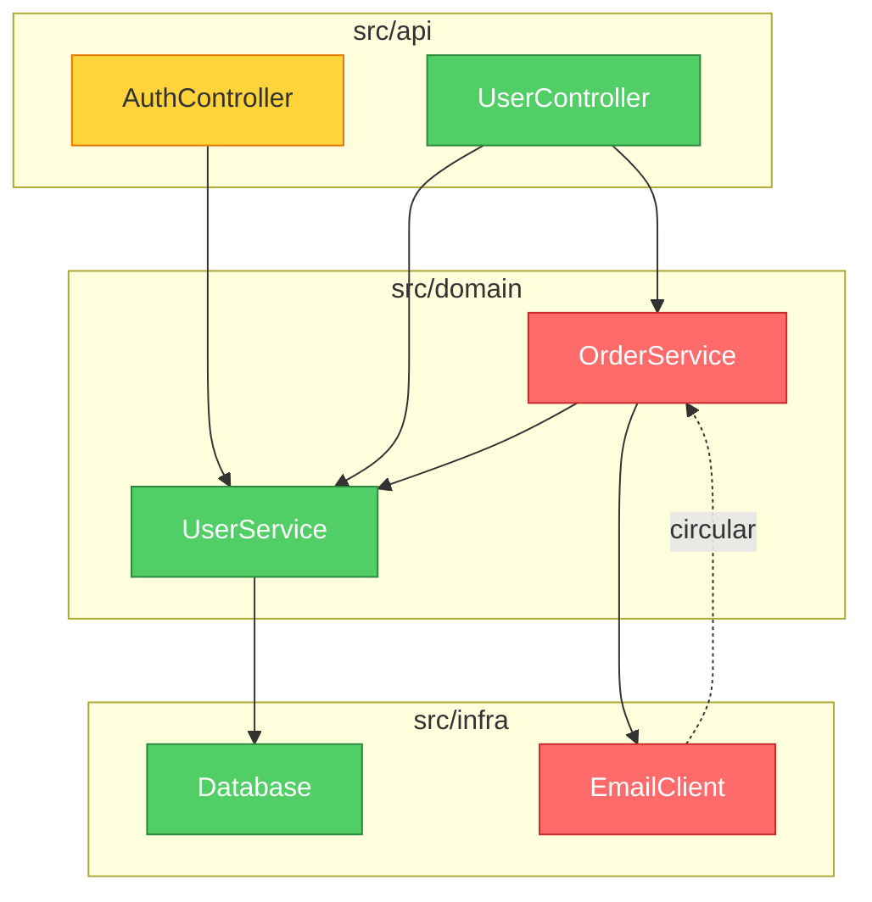

<p align="center">
  
</p>

<h1 align="center">brooks-lint</h1>

<p align="center">
  <strong>AI code reviews grounded in twelve classic engineering books.<br>
  Consistent. Traceable. Actionable.</strong>
</p>

<p align="center">
  <a href="#the-six-decay-risks">The Six Decay Risks</a> •
  <a href="#what-it-looks-like">What It Looks Like</a> •
  <a href="#benchmark">Benchmark</a> •
  <a href="#installation">Installation</a>
</p>

<p align="center">
  
  
  
  
  
</p>

---

> *"The bearing of a child takes nine months, no matter how many women are assigned."*
> — Frederick Brooks, *The Mythical Man-Month* (1975)

**50 years later, Brooks was still right — and so were McConnell, Fowler, Martin, Hunt & Thomas, Evans, Ousterhout, Winters, Meszaros, Osherove, Feathers, and the Google Testing team.**

Most code quality tools count lines and cyclomatic complexity. **brooks-lint** goes deeper — it diagnoses your code against six decay risk dimensions synthesized from twelve classic engineering books, producing structured findings with book citations, severity labels, and concrete remedies every time.

For the full source-to-skill mapping, including exceptions and false-positive guards, see
[`skills/_shared/source-coverage.md`](skills/_shared/source-coverage.md).

## The Twelve Books

| Book | Author | Contributes to |
|------|--------|----------------|
| *The Mythical Man-Month* | Frederick Brooks | R2, R4, R5 |
| *Code Complete* | Steve McConnell | R1, R4 |
| *Refactoring* | Martin Fowler | R1, R2, R3, R4, R6 |
| *Clean Architecture* | Robert C. Martin | R2, R5 |
| *The Pragmatic Programmer* | Hunt & Thomas | R2, R3, R4, R5, T2, T3 |
| *Domain-Driven Design* | Eric Evans | R1, R3, R6 |
| *A Philosophy of Software Design* | John Ousterhout | R1, R4 |
| *Software Engineering at Google* | Winters, Manshreck & Wright | R2, R5 |
| *The Art of Unit Testing* | Roy Osherove | T1, T2, T4, T5 |
| *How Google Tests Software* | James A. Whittaker, Jason Arbon & Jeff Carollo | T5, T6 |
| *Working Effectively with Legacy Code* | Michael Feathers | T4, T5, T6 |
| *xUnit Test Patterns* | Gerard Meszaros | T1, T2, T3, T4 |

## The Six Decay Risks

brooks-lint evaluates your code across **six production-code decay risks** and **six test-suite decay risks** synthesized from twelve classic engineering books:

| Decay Risk | Diagnostic Question | Sources |
|------------|---------------------|---------|
| 🧠 Cognitive Overload | How much mental effort to understand this? | Code Complete, Refactoring, DDD, Philosophy of SD |
| 🔗 Change Propagation | How many unrelated things break on one change? | Refactoring, Clean Architecture, Pragmatic, SE@Google |
| 📋 Knowledge Duplication | Is the same decision expressed in multiple places? | Pragmatic, Refactoring, DDD |
| 🌀 Accidental Complexity | Is the code more complex than the problem? | Refactoring, Code Complete, Brooks, Philosophy of SD |
| 🏗️ Dependency Disorder | Do dependencies flow in a consistent direction? | Clean Architecture, Brooks, Pragmatic, SE@Google |
| 🗺️ Domain Model Distortion | Does the code faithfully represent the domain? | DDD, Refactoring |

> Philosophy of SD = *A Philosophy of Software Design* (Ousterhout) · SE@Google = *Software Engineering at Google* (Winters et al.)

## What It Looks Like

Given this code:

```python
class UserService:
    def update_profile(self, user_id, name, email, avatar_url):
        user = self.db.query(f"SELECT * FROM users WHERE id = {user_id}")
        user['email'] = email
        ...
        if user['email'] != email:   # always False — silent bug
            self.smtp.send(...)
        points = user['login_count'] * 10 + 500
        self.db.execute(f"UPDATE loyalty SET points={points} WHERE user_id={user_id}")
```

brooks-lint produces:

---

**Health Score: 28/100**

*This method concentrates four unrelated business responsibilities into a single function, contains a logic bug that silently suppresses email change notifications, and is wide open to SQL injection.*

### 🔴 Change Propagation — Single Method Changes for Four Unrelated Business Reasons
**Symptom:** `update_profile` performs profile field updates, email change notifications, loyalty points recalculation, and cache invalidation all in one method body.
**Source:** Fowler — *Refactoring* — Divergent Change; Hunt & Thomas — *The Pragmatic Programmer* — Orthogonality
**Consequence:** Any change to the loyalty formula risks breaking email notifications and vice versa. Every edit carries regression risk across four unrelated domains simultaneously.
**Remedy:** Extract `NotificationService`, `LoyaltyService`, and `UserCacheInvalidator`. `UserService.update_profile` should orchestrate by calling each — it should hold no implementation logic itself.

### 🔴 Domain Model Distortion — Silent Logic Bug: Email Notification Never Fires
**Symptom:** `user['email'] = email` overwrites the old value before `if user['email'] != email` — the condition is always `False`. The notification is dead code.
**Source:** McConnell — *Code Complete* — Ch. 17: Unusual Control Structures
**Consequence:** Users are never notified when their email address changes. Silent data integrity failure — the system appears functional while violating a business rule.
**Remedy:** Capture `old_email = user['email']` before any mutation. Compare against `old_email`, not `user['email']`.

*(+ 6 more findings including SQL injection, dependency disorder, magic numbers)*

### Architecture Audit with Dependency Graph

In Mode 2 (Architecture Audit), brooks-lint generates a **Mermaid dependency graph** at the top of the report. Modules are color-coded by severity: red = Critical findings, yellow = Warning, green = clean.



The graph renders natively in GitHub, Notion, and other Markdown environments — no extra tools needed.

## See More Examples

The [Full Gallery](docs/gallery.md) has real brooks-lint output across Python, TypeScript, Go, and Java — including PR reviews, architecture audits with Mermaid dependency graphs, tech debt assessments, and test quality reviews.

---

## Benchmark

Tested across 3 real-world scenarios (PR review, architecture audit, tech debt assessment):

| Criterion | brooks-lint | Claude alone |
|-----------|:-----------:|:------------:|
| Structured findings (Symptom → Source → Consequence → Remedy) | ✅ 100% | ❌ 0% |
| Book citations per finding | ✅ 100% | ❌ 0% |
| Severity labels (🔴/🟡/🟢) | ✅ 100% | ❌ 0% |
| Health Score (0–100) | ✅ 100% | ❌ 0% |
| Detects Change Propagation | ✅ 100% | ✅ 100% |
| **Overall pass rate** | **94%** | **16%** |

The gap isn't what Claude *can* find — it's what it *consistently* finds, with traceable evidence and actionable remedies every time.

## How It Compares

| | brooks-lint | ESLint / Pylint | GitHub Copilot Review | Plain Claude |
|---|:---:|:---:|:---:|:---:|
| Detects syntax & style issues | — | ✅ | ✅ | ~ |
| Structured diagnosis chain | ✅ | ❌ | ❌ | ❌ |
| Traces findings to classic books | ✅ | ❌ | ❌ | ❌ |
| Consistent severity labels | ✅ | ✅ | ~ | ❌ |
| Architecture-level insights | ✅ | ❌ | ~ | ~ |
| Domain model analysis | ✅ | ❌ | ❌ | ~ |
| Zero config, no plugins to install | ✅ | ❌ | ✅ | ✅ |
| Works with any language | ✅ | ❌ | ✅ | ✅ |

> `~` = occasionally / inconsistently

**brooks-lint doesn't replace your linter.** It catches what linters can't: architectural drift, knowledge silos, and domain model distortion — the problems that slow teams down for months before anyone notices.

## Installation

### Claude Code (Recommended)

#### Via Plugin Marketplace
```bash
/plugin marketplace add hyhmrright/brooks-lint
/plugin install brooks-lint@brooks-lint-marketplace
```

Short-form commands (`/brooks-review`) are auto-installed on first session start. To install manually:
```bash
cp commands/*.md ~/.claude/commands/
```

#### Manual Install
```bash
cp -r skills/ ~/.claude/skills/brooks-lint
```

### Gemini CLI

#### Via Extension
```bash
/extensions install https://github.com/hyhmrright/brooks-lint
```

#### Manual Install
```bash
cp -r skills/ ~/.gemini/skills/brooks-lint
```

### Codex CLI

#### Via Skill Installer (in Codex session)
```
Install the brooks-lint skill from hyhmrright/brooks-lint
```

#### Command Line
```bash
python3 ~/.codex/skills/.system/skill-installer/scripts/install-skill-from-github.py \
  --repo hyhmrright/brooks-lint --path skills --name brooks-lint
```

#### Manual Install
```bash
git clone https://github.com/hyhmrright/brooks-lint.git /tmp/brooks-lint
mkdir -p ~/.codex/skills/brooks-lint
cp -r /tmp/brooks-lint/skills/* ~/.codex/skills/brooks-lint/
```

## Slash Commands

### Claude Code
| Command | Short Form | Action |
|---------|------------|--------|
| `/brooks-lint:brooks-review` | `/brooks-review` | PR-level code review |
| `/brooks-lint:brooks-audit` | `/brooks-audit` | Full architecture audit |
| `/brooks-lint:brooks-debt` | `/brooks-debt` | Tech debt assessment |
| `/brooks-lint:brooks-test` | `/brooks-test` | Test suite health review |
| `/brooks-lint:brooks-health` | `/brooks-health` | Health dashboard — all four dimensions |

> Short-form commands are auto-installed on first session start by the session-start hook.

### Gemini CLI
| Command | Action |
|---------|--------|
| `/brooks-review` | PR-level code review |
| `/brooks-audit` | Full architecture audit |
| `/brooks-debt` | Tech debt assessment |
| `/brooks-test` | Test suite health review |
| `/brooks-health` | Health dashboard — all four dimensions |

### Codex CLI

| Command | Action |
|---------|--------|
| `$brooks-review` | PR-level code review |
| `$brooks-audit` | Full architecture audit |
| `$brooks-debt` | Tech debt assessment |
| `$brooks-test` | Test suite health review |
| `$brooks-health` | Health dashboard — all four dimensions |

The skills also trigger automatically when you discuss code quality, architecture, maintainability, or test health.

## Usage

### PR Review

```
/brooks-review                      # Claude Code (short form) / Gemini CLI
/brooks-lint:brooks-review          # Claude Code (full form)
$brooks-review                      # Codex CLI
```

Paste a diff or point the AI at changed files. Diagnoses each of the six decay risks with specific findings in Symptom → Source → Consequence → Remedy format.

### Architecture Audit

```
/brooks-audit                       # Claude Code (short form) / Gemini CLI
/brooks-lint:brooks-audit           # Claude Code (full form)
$brooks-audit                       # Codex CLI
```

Describe your project structure or share key files. It maps module dependencies, identifies circular dependencies, and checks Conway's Law alignment.

### Tech Debt Assessment

```
/brooks-debt                        # Claude Code (short form) / Gemini CLI
/brooks-lint:brooks-debt            # Claude Code (full form)
$brooks-debt                        # Codex CLI
```

Classifies your debt across the six decay risks, scores each finding by Pain × Spread priority, and produces a prioritized repayment roadmap with Critical / Scheduled / Monitored classification.

### Test Quality Review

```
/brooks-test                        # Claude Code (short form) / Gemini CLI
/brooks-lint:brooks-test            # Claude Code (full form)
$brooks-test                        # Codex CLI
```

Audits your test suite against six test-space decay risks — Test Obscurity, Test Brittleness, Test Duplication, Mock Abuse, Coverage Illusion, and Architecture Mismatch — sourced from xUnit Test Patterns, The Art of Unit Testing, How Google Tests Software, and Working Effectively with Legacy Code. PR reviews also include a lightweight Step 7 Quick Test Check automatically.

### Health Dashboard

```
/brooks-health                      # Claude Code (short form) / Gemini CLI
/brooks-lint:brooks-health          # Claude Code (full form)
$brooks-health                      # Codex CLI
```

Runs abbreviated scans across all four quality dimensions and produces a weighted composite Health Score (0–100). Use it before a release, when onboarding a new team, or whenever you want a big-picture "how are we doing?" report. For deeper diagnosis on any dimension, use the focused skill instead.

## Configuration

Place a `.brooks-lint.yaml` in your project root to customize review behavior:

```yaml
version: 1

disable:
  - T5   # skip coverage metrics check — we don't enforce coverage

severity:
  R1: suggestion   # downgrade Cognitive Overload findings for this domain

ignore:
  - "**/*.generated.*"
  - "**/vendor/**"
```

Copy [`.brooks-lint.example.yaml`](.brooks-lint.example.yaml) as a starting point.
All settings are optional — omit the file entirely for default behavior.

| Setting | Description |
|---------|-------------|
| `disable` | Risk codes to skip (`R1`–`R6`, `T1`–`T6`) |
| `severity` | Override severity tier (`critical` / `warning` / `suggestion`) |
| `ignore` | Glob patterns for files to exclude |
| `focus` | Evaluate only these risk codes (cannot combine with `disable`) |

---

## Why These Books, Why Now?

In the age of AI-assisted coding, we're writing more code faster than ever. But the insights from six decades of software engineering haven't changed:

> *"The complexity of software is an essential property, not an accidental one."*
> — Frederick Brooks

AI can help you write code faster, but it can't tell you whether you're building a cathedral or a tar pit. **brooks-lint bridges that gap** — it brings the hard-won wisdom of twelve classic engineering books into your modern development workflow.

The decay risks these authors identified are more relevant than ever:
- **Adding AI assistants** doesn't fix cognitive overload or domain model distortion
- **Generating more code** increases change propagation and knowledge duplication
- **Moving faster** makes accidental complexity and dependency disorder even more dangerous

## Project Structure

```
brooks-lint/
├── .claude-plugin/              # Claude Code plugin metadata
├── .codex-plugin/               # Codex CLI plugin metadata
├── skills/
│   ├── _shared/                 # Shared framework files
│   │   ├── common.md            # Iron Law, Project Config, Report Template, Health Score
│   │   ├── source-coverage.md   # 12-book coverage matrix, tradeoffs, false-positive guards
│   │   ├── decay-risks.md       # Six decay risks with symptoms and book citations
│   │   └── test-decay-risks.md  # Six test-space decay risks with book citations
│   ├── brooks-review/           # Mode 1: PR Review
│   │   ├── SKILL.md
│   │   └── pr-review-guide.md
│   ├── brooks-audit/            # Mode 2: Architecture Audit
│   │   ├── SKILL.md
│   │   └── architecture-guide.md
│   ├── brooks-debt/             # Mode 3: Tech Debt Assessment
│   │   ├── SKILL.md
│   │   └── debt-guide.md
│   ├── brooks-test/             # Mode 4: Test Quality Review
│   │   ├── SKILL.md
│   │   └── test-guide.md
│   └── brooks-health/           # Mode 5: Health Dashboard
│       ├── SKILL.md
│       └── health-guide.md
├── hooks/                       # SessionStart hook
├── commands/                    # Short-form command wrappers (auto-installed by hook)
├── evals/                       # Benchmark test cases
│   └── evals.json
└── assets/
    └── logo.svg
```

## CI/CD Integration

Automate brooks-lint on every PR using the GitHub Action:

```yaml
# .github/workflows/brooks-lint.yml
name: Brooks-Lint PR Review
on:
  pull_request:
    types: [opened, synchronize, reopened]

jobs:
  brooks-lint:
    runs-on: ubuntu-latest
    permissions:
      pull-requests: write
    steps:
      - uses: actions/checkout@v4
        with:
          fetch-depth: 0
      - uses: hyhmrright/brooks-lint/.github/actions/brooks-lint@main
        with:
          mode: review
          anthropic-api-key: ${{ secrets.ANTHROPIC_API_KEY }}
          fail-below: 70
```

See [`docs/github-action-example.yml`](docs/github-action-example.yml) for the full template.

The action posts the review as a PR comment and optionally fails the check if the Health Score drops below a threshold. If `.brooks-lint-history.json` is committed to your repo, the comment also includes a trend delta (e.g., "85 → 82 (−3) over last 3 runs").

**Cost:** ~$0.05–0.15 per PR run depending on diff size and model. Recommend running on `pull_request` events only.

## Roadmap

- [x] **v0.2**: Plugin infrastructure (`.claude-plugin/`, hooks, slash commands)
- [x] **v0.3**: Eight Brooks dimensions, documentation completeness scoring
- [x] **v0.4**: Six-book framework, decay risk dimensions, diagnosis chain, benchmark suite
- [x] **v0.5**: Test Quality Review (Mode 4) — four testing books, six test decay risks
- [x] **v0.6**: Mermaid dependency graph in Architecture Audit
- [x] **v0.7**: `.brooks-lint.yaml` project config, Mode 2 proactive context, 10-book expansion
- [x] **v0.8**: Independent skill architecture with namespaced commands
- [x] **v0.9**: Step validation, auto-diff scope, `/brooks-health` dashboard, trend tracking, triage mode, `--fix` remedies, onboarding report, GitHub Action
- [x] **v1.0**: Eval automation (`run-evals-live.mjs`), custom risk extension (`Cx` codes)

Want to help? The best contributions right now are new eval test cases and improved decay risk symptom patterns. See [CONTRIBUTING.md](CONTRIBUTING.md).

## Contributing

See [CONTRIBUTING.md](CONTRIBUTING.md) for how to add findings, improve guides, or expand the benchmark suite.

Run `/brooks-review` on your own PR — we review contributions with the tool we're building.

## License

MIT License — see [LICENSE](LICENSE) for details.

## Acknowledgments

This project stands on the shoulders of twelve giants:

**Production Code Framework**
- Frederick P. Brooks Jr. — *The Mythical Man-Month* (1975, Anniversary Edition 1995)
- Steve McConnell — *Code Complete* (1993, 2nd ed. 2004)
- Martin Fowler — *Refactoring* (1999, 2nd ed. 2018)
- Robert C. Martin — *Clean Architecture* (2017)
- Andrew Hunt & David Thomas — *The Pragmatic Programmer* (1999, 20th Anniversary Ed. 2019)
- Eric Evans — *Domain-Driven Design* (2003)
- John Ousterhout — *A Philosophy of Software Design* (2018)
- Titus Winters, Tom Manshreck, and Hyrum Wright — *Software Engineering at Google* (2020)

**Test Quality Framework**
- Gerard Meszaros — *xUnit Test Patterns* (2007)
- Roy Osherove — *The Art of Unit Testing* (2009, 3rd ed. 2023)
- Google Engineering — *How Google Tests Software* (2012)
- Michael Feathers — *Working Effectively with Legacy Code* (2004)

The decay risks encoded in this tool are our synthesis of their ideas, applied to modern code quality assessment.

---

<p align="center">
  <strong>⭐ If this tool helped you see your codebase differently, give it a star!</strong>
</p>
